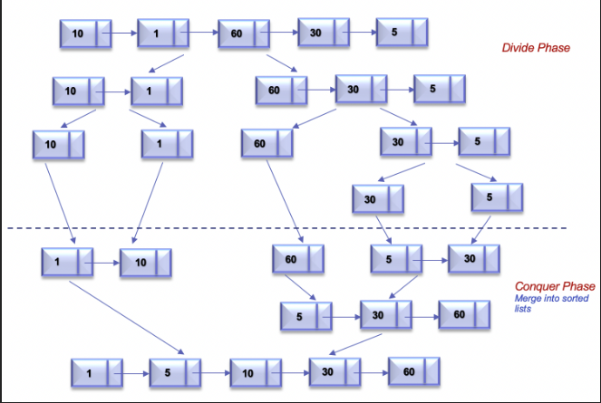
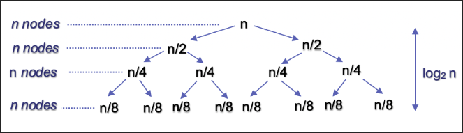

# Singly Linked List

Algorithms on a singly linked list

## Sort List in Ascending Order

The problem is to sort the linked list in O(nlogn) time and using only constant extra space. If we look at various sorting algorithms, Merge Sort is one of the efficient sorting algorithms that is popularly used for sorting the linked list. The merge sort algorithm runs in O(nlogn) time in all the cases. Let's discuss approaches to sort linked list using merge sort.

> Quicksort is also one of the efficient algorithms with the average time complexity of O(nlogn). But the worst-case time complexity is O(n^2). Also, variations of the quick sort like randomized quicksort are not efficient for the linked list because unlike arrays, random access in the linked list is not possible in O(1) time. If we sort the linked list using quicksort, we would end up using the head as a pivot element which may not be efficient in all scenarios.

Merge sort is a popularly known algorithm that follows the Divide and Conquer Strategy. The divide and conquer strategy can be split into 2 phases:

Divide phase: Divide the problem into subproblems.

Conquer phase: Repeatedly solve each subproblem independently and combine the result to form the original problem.

The Top Down approach for merge sort recursively splits the original list into sublists of equal sizes, sorts each sublist independently, and eventually merge the sorted lists. Let's look at the algorithm to implement merge sort in Top Down Fashion.

Algorithm

Recursively split the original list into two halves. The split continues until there is only one node in the linked list (Divide phase). To split the list into two halves, we find the middle of the linked list using the Fast and Slow pointer approach as mentioned in Find Middle Of Linked List.

Recursively sort each sublist and combine it into a single sorted list. (Merge Phase). This is similar to the problem Merge two sorted linked lists

The process continues until we get the original list in sorted order.

For the linked list = [10,1,60,30,5], the following figure illustrates the merge sort process using a top down approach.



### Complexity Analysis

- Time Complexity: O(nlogn), where nnn is the number of nodes in linked list. The algorithm can be split into 2 phases, Split and Merge.
Let's assume that nnn is power of 222. For n = 16, the split and merge operation in Top Down fashion can be visualized as follows



    Split

    The recursion tree expands in form of a complete binary tree, splitting the list into two halves recursively. The number of levels in a complete binary tree is given by log⁡2n. For n=16, number of splits = log2 16=4

    Merge

    At each level, we merge n nodes which takes O(n) time. For n=16, we perform merge operation on 16 nodes in each of the 4 levels.

    So the time complexity for split and merge operation is O(nlog⁡n)

- Space Complexity. O(logn) , where nnn is the number of nodes in linked list. Since the problem is recursive, we need additional space to store the recursive call stack. The maximum depth of the recursion tree is log n

---

## Delete the middle Node of a Linked List

You are given the head of a linked list. Delete the middle node, and return the middle node of the modified linked list.

The middle node of a linked list of size n is the ⌊n / 2⌋th node from the start using 0-based indexing.

For n = 1, 2, 3, 4, and 5, the middle nodes are 0, 1, 1, 2, and 2, respectively.

```plain
Example 1:

Input: head = [1,3,4,7,1,2,6]
Output: [1,3,4,1,2,6]
Explanation:
The above figure represents the given linked list. The indices of the nodes are written below.
Since n = 7, node 3 with value 7 is the middle node, which is marked in red.
We return the new list after removing this node. 
```

```plain
Example 2:

Input: head = [1,2,3,4]
Output: [1,2,4]
Explanation:
The above figure represents the given linked list.
For n = 4, node 2 with value 3 is the middle node, which is marked in red.
```

```plain
Input: head = [2,1]
Output: [2]
Explanation:
The above figure represents the given linked list.
For n = 2, node 1 with value 1 is the middle node, which is marked in red.
Node 0 with value 2 is the only node remaining after removing node 1.
```

### Solution(s)

#### Approach 1: 2 Passes

##### Intuition

Let's start with a simple approach.

We make the first iteration, starting from head, going through the entire linked list and getting the total number of
nodes (let's say `node_count`). According to the definition provided, the index of the middle node is:
`middleIndex=floor(node_count / 2)−1`.

Now we make a second iteration to the `predecessor` node of the middle node, which means that we stop at index
`middleIndex - 1`.

Once we reach the predecessor node of the middle node, we can remove the middle node from the linked list.

##### Algorithm

1. If there is only one node, return None.
2. Otherwise, initialize two pointers p1 = head and p2 = head.
3. Iterate the linked list with p1 and count the total number of nodes it has (count).
4. Let p2 move forward by floor(node_count / 2) - 1 nodes, now it is the predecessor of the middle node, delete the
   middle node. Return the middle node.

```go
func DeleteMiddle[T comparable](head *list.Node[T]) *list.Node[T] {
 if head == nil || head.Next == nil {
  return nil
 }

 pointer := head
 current := head
 nodeCount := 0

 for pointer != nil {
    pointer = pointer.Next
    nodeCount++
 }

 middleIndex := nodeCount / 2

 for i := 0; i < middleIndex-1; i++ {
  current = current.Next
 }

 middleNode := current.Next
 current.Next = current.Next.Next

 return middleNode
}
```

> Note that this has been implemented in the [SinglyLinkedList](./linkedlist.go) class but with slight
> modifications

##### Complexity Analysis

Let `n` be the length of the input linked list.

1. `Time complexity: O(n)`

    - We iterate over the linked list twice, the first time traversing the entire linked list and the second traversing
      half of it. Hence there are a total of `O(n)` steps.
    - In each step, we move a pointer forward by one node, which takes constant time.
    - Remove the middle node takes a constant amount of time.
    - In summary, the overall time complexity is `O(n)`.

2. `Space complexity: O(1)`

    - We only need two pointers, thus the space complexity is `O(1)`.

#### Approach 2: 2 Pointers

##### Intuition

The key of this approach is that we have two pointers `fast` and `slow` traversing the linked list at the same time, and
`fast` traverses twice as fast as `slow`. Therefore, when `fast` reaches the end of the linked list, `slow` is right in
the middle! We only need one iteration to reach the middle node!

All that needs to be determined are a few lookup details. If there is only one node in the linked list, this node is
also the one to be deleted and there are no nodes left after the deletion. Therefore, instead of initializing two
pointers for the following procedure, we can just return null.

> Why we initialize fast = head.next.next at the beginning?

The reason for this is that we want to delete the middle node instead of finding it. Therefore, we are actually looking
for the `predecessor` of the middle node, not the middle node itself, or rather, this is like moving slow backward one
node after the iteration stops.

Certainly, we can't move a pointer backward on a singly linked list, thus we can show this one less step on `slow` by
letting `fast` moves forward one more step (by two nodes, of course). Hence, `slow` will also point to the predecessor
node of the middle node (rather than the middle node) at the end of the iteration.

##### Algorithm

1. If there is only one node, return null.
2. Otherwise, initialize two pointers `slow` and `fast`, with slow pointing to head and fast pointing to the second
   successor node of head.
3. While neither `fast` and `fast.next` is `null`:
    - we move `fast` forward by 2 nodes.
    - we move `slow` forward by 1 node.
4. Now `slow` is the predecessor of the middle node, delete the middle node.
5. Return middle node.

``` go
func DeleteMiddle2Pointers[T comparable](head *list.Node[T]) *list.Node[T] {
 if head == nil || head.Next == nil {
  return nil
 }

 slowPointer, fastPointer := head, head.Next.Next

 for fastPointer != nil && fastPointer.Next != nil {
  slowPointer = slowPointer.Next
  fastPointer = fastPointer.Next.Next
 }

 middleNode := slowPointer.Next
 slowPointer.Next = slowPointer.Next.Next

 return middleNode
}
```

> Note that the implementation outlined here is what is denoted in the instance method `delete_middle_node_2_pointers`
> of the class [SinglyLinkedList](SinglyLinkedList.kt) with some slight modifications

##### Complexity Analysis

1. `Time Complexity O(n)`
    - We stop the iteration when the pointer fast reaches the end, fast moves forward 2 nodes per step, so there are at
      most `n/2` steps.
    - In each step, we move both `fast` and `slow`, which takes a constant amount of time.
    - Removing the middle node also takes constant time.
    - In summary, the overall time complexity is `O(n)`.

2. `Space Complexity O(1)`

    - We only need 2 pointers, so the space complexity is `O(1)`

---

### Related Topics

- Linked List
- Two Pointers

---

## Odd Even List

Given the head of a singly linked list, group all the nodes with odd indices together followed by the nodes with even
indices, and return the reordered list.

The first node is considered odd, and the second node is even, and so on.

Note that the relative order inside both the even and odd groups should remain as it was in the input.

You must solve the problem in O(1) extra space complexity and O(n) time complexity.

```plain
Example 1:

1 -> 2 -> 3 -> 4 -> 5]

becomes:

1 -> 3 -> 5 -> 2 -> 4

Input: head = [1,2,3,4,5]
Output: [1,3,5,2,4]

Example 2:

2 -> 1 -> 3 -> 5 -> 6 -> 4 -> 7
2 -> 3 -> 6 -> 7 -> 1 -> 5 -> 4

Input: head = [2,1,3,5,6,4,7]
Output: [2,3,6,7,1,5,4]
```

### Solution

#### Intuition

Put the odd nodes in a linked list and the even nodes in another. Then link the evenList to the tail of the oddList.

#### Algorithm

The solution is very intuitive. But it is not trivial to write a concise and bug-free code.

A well-formed LinkedList need two pointers head and tail to support operations at both ends. The variables head and odd
are the head pointer and tail pointer of one LinkedList we call oddList; the variables evenHead and even are the head
pointer and tail pointer of another LinkedList we call evenList. The algorithm traverses the original LinkedList and put
the odd nodes into the oddList and the even nodes into the evenList. To traverse a LinkedList we need at least one
pointer as an iterator for the current node. But here the pointers odd and even not only serve as the tail pointers but
also act as the iterators of the original list.

#### Complexity Analysis

##### Time Complexity O(n)

There are total n nodes and we visit each node once.

##### Space Complexity O(1)

All we need is the four pointers.

### Related Topics

- Linked List

## Maximum Twin Sum of a Linked List

In a linked list of size n, where n is even, the ith node (0-indexed) of the linked list is known as the twin of the (
n-1-i)th node, if 0 <= i <= (n / 2) - 1.

For example, if n = 4, then node 0 is the twin of node 3, and node 1 is the twin of node 2. These are the only nodes
with twins for n = 4.
The twin sum is defined as the sum of a node and its twin.

Given the head of a linked list with even length, return the maximum twin sum of the linked list.

```plain
Example 1:

Input: head = [5,4,2,1]
Output: 6
Explanation:
Nodes 0 and 1 are the twins of nodes 3 and 2, respectively. All have twin sum = 6.
There are no other nodes with twins in the linked list.
Thus, the maximum twin sum of the linked list is 6.

Example 2:
Input: head = [4,2,2,3]
Output: 7
Explanation:
The nodes with twins present in this linked list are:
- Node 0 is the twin of node 3 having a twin sum of 4 + 3 = 7.
- Node 1 is the twin of node 2 having a twin sum of 2 + 2 = 4.
Thus, the maximum twin sum of the linked list is max(7, 4) = 7.

Example 3:
Input: head = [1,100000]
Output: 100001
Explanation:
There is only one node with a twin in the linked list having twin sum of 1 + 100000 = 100001.
```

### Solutions

#### Approach 1: Using List Of Integers

We can see that the `ith` node from the start is the twin of the `ith`node from the end. The first node is the twin of
the last node, the second node is the twin of the second last node, and so on. Because we are guaranteed an even number
of nodes in the linked list, each node in the first half has a twin in the second half.

An intuitive solution is to iterate over the entire linked list and push the value of each node into a list of integers.
The list of integers is then iterated over using two pointers, i(left) and j(right). The pointer i points to the
beginning of the list, while j points to the end.

To get the twin sum of the pair under consideration, we add the values indicated by the pointers. To get the next pair
of twins, we increment i and decrement j and try to update the answer wherever we can with the twin sum. We repeat this
process until we have covered all of the twin pairs, i.e., until i >= j.

##### Algorithm

1. Create a ListNode pointer current. Initialize it to head.
2. Create an empty list of integers values to store the node values in the given linked list.
3. Iterate while current is not null:
    - Push current.val into values.
    - Update current to current.next.
4. Create two integer variables i = 0 and j = values.size() - 1 that will help us to get all the twin sums.
5. Create an answer variable maximumSum to keep track of the maximum sum of a node and its twin. Initialize it to 0.
6. While i < j:
    - Update maximumSum if the current twin sum is greater than the previous one, i.e., maximumSum = max(maximumSum,
      values[i] + values[j]).
    - Increment i by 1.
    - Decrement j by 1.

7. Return maximumSum.

> This is the default algorithm implemented in [utils](./utils.go) in the `maximum_pair_sum`
> method

##### Complexity Analysis

Here, `n` is the number of nodes in the linked list.

1. `Time complexity: O(n)`

    - Iterating over the entire linked list and pushing all the node values in values takes `O(n)` time.
    - We iterate over the first half of the linked list to find the maximum twin sum, which also takes `O(n)` time.

2. `Space complexity: O(n)`

    - The values list takes `O(n)` space as we push `n` elements into it.

#### Approach 2: Using Stack

As you may have guessed, we require a method to obtain the values of the nodes in the second half of the linked list in
reverse order. Getting the values of the nodes is simple. We can do so by using head, which points to the first node in
the list and then using next we can get all the next nodes,

We can use a stack to get the values of the second half nodes in reverse order. We iterate over the linked list, pushing
all of the node values into the stack.

To compute the twin sums, we iterate from the beginning of the list with head and get the values of the nodes from the
end using the stack. We find the first half nodes using next pointers and pop from the top of the stack to get the
second half nodes.

##### Algorithm

1. Create a ListNode pointer current. Initialize it equal to head.
2. Initialize an integer stack st to store the node values in the given linked list.
3. Iterate while current is not null:
    - Push `current.val` into `stack`.
    - Update `current` to `current.next`.
4. Update current to head to iterate the list again from the start.
5. To begin counting the number of twin pairs, create two integers size = st.size() and count. To cover all the twin
   pairs, we start counting from 1 and go until st.size() / 2.
6. Create an answer variable maximumSum to keep track of the maximum sum of a node and its twin. Initialize it to 0.
7. While count <= size/2:
    - Update maximumSum if the current twin sum is greater than the previous one, i.e.,maximumSum = max(maximumSum,
      current.val + st.top()).
    - Update current to current.next.
    - Pop the top element out of the stack.
    - Increment count by 1.
8. Return maximumSum.

##### Complexity Analysis

Here, `n` is the number of nodes in the linked list.

1. `Time complexity: O(n)`

    - Iterating over the linked list and pushing all the node values in `stack` takes `O(n)` time.
    - We iterate over the first half of the linked list to find the maximum twin sum, which also takes O(n)
      time.

2. Space complexity: `O(n)`

    - The stack takes `O(n)` space as we push `n` elements into it.

#### Approach 3: Reverse Second Half in Place

Another method is to flip the second half of the linked list so that the last element points to the second last element,
which points to the third last element, and so on until the middle element.

To reverse the second half of the linked list, we must first obtain the list's middle (from which the second half
starts). To get to the middle of the list, we can use two pointers: slow and fast. We set their initial value to head.

We move slow to the next node after moving fast two nodes ahead. We perform this until fast or fast.next do not become
null. Because fast moves at twice the speed of slow, we will have the required middle node at slow.

Reversing a linked list is a classic problem. We need three pointers: a) nextNode, to hold the next node so that when we
reverse the next pointer of the previous node, we have access to the next node, b) slow, the node under consideration
whose next must be set to the previous node, and c) prev, the previous node.

We first perform nextNode = slow.next so we can still reach the next node after modifying slow.next. Then we set the
next pointer of slow to prev.

To set up the variables for next iteration, we set prev = slow and slow = nextNode. We continue doing while till slow is
not null.

Once we've reversed the second half of the list, prev will point to the first element of this reversed list. So we use
head to iterate over the original list because the first half is unaffected, and prev to iterate over the reversed list.
We add the corresponding node values, update the maximum twin sum with the current twin if possible, and then proceed to
the next node in both lists.

##### Algorithm

1. Create two ListNode pointers slow and fast. Initialize both of them to head.
2. To get the middle of the list, we move fast two steps ahead and slow one step ahead. We iterate until we can't move
   two steps ahead, i.e., while fast and fast.next are not null:

    - Update fast to two nodes ahead, i.e., fast = fast.next.next.
    - Update slow to slow.next.

3. The next step is to reverse the second half of the linked list. We create two pointers to null: nextNode and prev as
   mentioned above. While slow is not null, we do the following:

    - Update nextNode to nextNode = slow.next.
    - Set pointer of slow to prev.
    - Move prev to slow, as this will be the new previous node for the next iteration.
    - Move slow to nextNode, since nextNode is the node being considered for the next iteration.

4. Create an answer variable maximumSum to keep track of the maximum sum of a node and its twin. Initialize it to 0.
5. Create another ListNode pointer start = head to iterate from the start of the linked list.
6. To obtain twin sums, we use the corresponding nodes of the given linked list and the reversed linked list. We iterate
   until we cover either of the lists, i.e., until prev is not null:

    - Update maximumSum if the current twin sum is greater than the previous one, i.e.,maximumSum = max(maximumSum,
      start.val + prev.val).
    - Update prev to prev.next and start to start.next.

7. Return maximumSum.

##### Complexity Analysis

Here `n` is the number of nodes in the linked list

1. `Time complexity: O(n)`

    - It takes O(n) time to iterate over the linked list to find the middle and then reverse the second half of
      the linked list.
    - We iterate over the half of the linked list to find the maximum twin sum, which also takes O(n) time.

2. `Space complexity: O(1)`

    - Except for a few pointers that take up constant space, we don't take up any space.

### Related Topics

- Linked List
- Two Pointers
- Stack

---

## Reverse Nodes in k-Group

The task is to reverse the nodes in groups of k in a given linked list, where k is a positive integer, and at most the
length of the linked list. If any remaining nodes are not part of a group of k, they should remain in their original
order.

It is not allowed to change the values of the nodes in the linked list. Only the order of the nodes can be modified.

> Note: Use only O(1) extra memory space

### Constraints

Let `n` bt the number of nodes in a linked list
- 1 <= `k` <= `n` <= 500
- 0 <= `Node.value` <= 1000

### Solution

- [Naive Approach](#naive-approach)
- [Optimized Approach Using In-Place Manipulation of Linked List](#optimized-approach-using-in-place-manipulation-of-a-linked-list)

#### Naive Approach

A naive approach would be to use another data structure—like a stack—to reverse the nodes of the linked list and then
create a new linked list with reversed nodes. Here’s how the algorithm works:

- We iterate the linked list. 
- We push the k group of nodes to the stack. 
- We pop all k numbers of nodes from the stack and add the nodes to a new linked list. When we do this, the stack will
  give us the reversed nodes in the k group.
- We repeat the above steps for every group of size k present in our linked list.
- In the end, if there are less than k nodes left in the original linked list, we’ll point the tail of the reversed
  linked list to the remaining nodes of the original linked list.

The time complexity of this solution is O(n), since we traverse the linked list once. However, the space complexity is 
O(n+k), where n is the length of the linked list to store the reversed elements and k is the length of the stack. If a
linked list contains thousands of nodes, we need to allocate a lot of memory resources to solve this problem. Let’s see
if we can use the in-place linked list manipulation pattern to reduce the space complexity of our solution.

#### Optimized approach using in-place manipulation of a linked list

This approach optimizes space by reversing groups of k nodes directly within the linked list, treating each group as a
mini-linked list for in-place reversal. The approach progresses by first identifying contiguous groups of exactly k nodes.
Upon finding such a group, it reverses the nodes within the group in place, ensuring an efficient reorganization without
using extra memory. After each reversal, the algorithm reattaches the reversed group segment back to the body of the list,
maintaining the overall remaining structure. This process is repeated until it encounters a segment with fewer than k
nodes.


##### Step-by-step solution construction

We will first traverse the linked list and check which groups of k nodes can be reversed. Here is how the algorithm works:

- We initialize a node, `dummy`, and attach it to the start of the linked list, i.e., by setting its next pointer equal to 
  the head.
- We set a pointer, `ptr`, equal to the `dummy` node. We will use this pointer to traverse the linked list.
- We traverse the linked list till `ptr` becomes NULL:
  - We initialize a pointer, `tracker`, to `ptr`. This pointer will be used to keep track of the number of nodes in the
    current group in the linked list.
  - We use a nested loop to try to move `tracker` _k_ nodes forward in the linked list. If tracker becomes NULL before
    moving _k_ nodes forward, the end of the linked list has been reached and the current group can not be traversed,
    since it contains less than k nodes. Therefore, we break out of the nested loop. Otherwise, the current group contains 
    k nodes and tracker will point to the kth node of the current group.
- After the completion of the nested loop, we check if `tracker` points to NULL:
  - If it does, we’ve reached the end of the linked list. The current group contains less than k nodes and cannot be
    reversed. Therefore, we break out of the outer loop, and the algorithm ends.
  - If it does not, the current group contains `k` nodes and can therefore be reversed.

The next step is to reverse the first group of `k` nodes. Here is how the algorithm works:

- For the case where tracker does not point to NULL, we declare three pointers:
  - current 
  - previous 
  - next
- We call the `reverse_linked_list` function, which reverses the current group of nodes and updates the above three
  pointers by returning their values.
- After the reversal, we have a fragmented group that has been separated from the rest of the list. The `previous` pointer
  now points to the first node of the reversed group while the `current` and `next` pointers now point to the first
  node of the next group.
- We break out of the outer loop to end the algorithm once the first group has been reversed.

After reversing the first group of k nodes, we need to reattach it to the rest of the linked list. Here is how the
algorithm works:

- We first need to access the last node in the reversed group. The `ptr` pointer is currently pointing to the node
  immediately before the last node of the reversed group. We initialize a new pointer, `last_node_of_reversed_group`,
  and set it equal to the next node of `ptr`. This node now points to the last node of the reversed group.
- We now need to link the last node of the reversed group to the first node of the linked list coming after it. The
  `current` pointer is currently pointing to the first node of the next group. We set the next node of
  `last_node_of_reversed_group` to the `current` pointer.
- We now need to link the first node of the reversed group to the last node of the linked list that comes before it.
  The `previous` node is currently pointing to the first node of the reversed group. We set the next node of `ptr` equal
  to the previous pointer.
- Lastly, we need to set the `ptr` pointer equal to the last node of the reversed group, which resets its position so
  that we can attempt to reverse the next group. We do this by setting the `ptr` pointer equal to the
  `last_node_of_reversed_group` pointer.
- We break out of the outer loop to end the algorithm once the first reversed group has been reattached to the linked
  list.

Finally, the last step is to repeat the above process for all groups of k nodes. This is done by simply not breaking
out of the outer loop once the first group has been reversed and attached. After the linked list has been traversed,
i.e., ptr becomes NULL, we return the next node of dummy, which contains the reversed linked list attached to it.

##### Solution Summary

To recap, the solution to this problem can be divided into the following four main parts:

- Check if there are `k` nodes present in the current group. 
- If the current group contains `k` nodes, reverse it. 
- Reattach the reversed group to the rest of the linked list. 
- Repeat the process above until there are less than `k` nodes left in the linked list.

##### Time Complexity

The time complexity of this solution is O(n), where n is the number of nodes in the list

##### Space complexity

The space complexity of this solution is O(1), since we'll use a constant number of additional variables to maintain the
connections between the nodes during reversal
