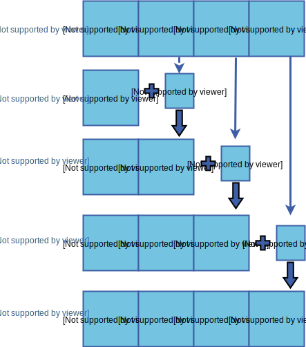

# Prefix Sum

The Prefix Sum of an array arr of length n is another array prefixSum_arr of the same length such that the value of the ith index in prefixSum_arr is the sum of all values from arr[0], arr[1]...arr[i].

